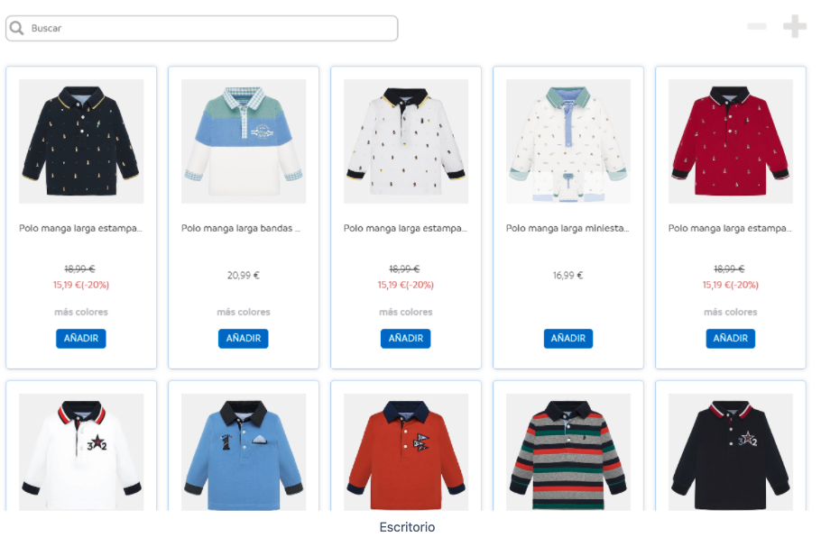

# Mayoral Frontend Assignment

|  Desktop | Mobile |
|:--------:|:------:|
|  |   |
|  Desktop Solution | Mobile Solution |
| | |

Para usar el projecto localmente haz un clon del repositorio. Navega al directorio y usa el codigo npm install. Despues usa el comando npm run dev. 

Tecnologías/Librerías usadas:

-	React 
-	Typescript
-	Next.js

Funcionalidad implementada:

- Separado en componentes de una forma óptima y organizada 
- La vista se asemeja lo más parecido posible a las fotos adjuntas
- Búsqueda de productos por nombre
- Consumir un JSON con los datos de productos (JSON local o externo) en el directorio public productos.JSON. Si el producto especifica un descuento la pagina lo demuestra adecuadamente.
- Cambiar la vista con los iconos indicados en la foto: 
  - Escritorio de 4 a 3 elementos
  - Móvil de 3 a 2 elementos
- Implementar lógica y diseño de un componente “ordenar” (precio ascendente y descendente). La prueba no especificaba donde ponerlo entonces se encuentra abajo de los productos.

